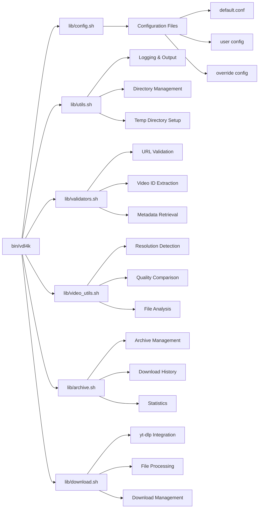
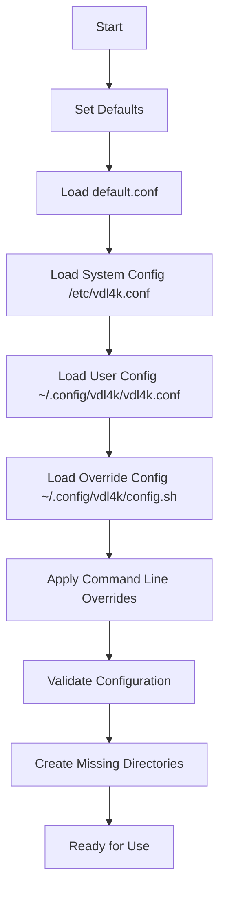

# vdl4k Modular Architecture Flowchart

```mermaid
graph TD
    A[vdl4k-v0.56] --> B[Initialization & Configuration]
    A --> C[Modular Components]
    A --> D[Main Execution Flow]
    A --> E[Entry Point]

    B --> B1[Load Modules: config, utils, validators, video_utils, archive, download]
    B --> B2[Set Bash Options: nounset, pipefail]
    B --> B3[Configuration Loading: Default → User → Override]
    B --> B4[Setup Directories: CONFIG_DIR, CACHE_DIR, TEMP_BASE_DIR]
    B --> B5[Validate Dependencies: yt-dlp, ffmpeg, ffprobe]

    C --> C1[lib/config.sh - Configuration Management]
    C1 --> C11[load_all_configs: Load configuration files in order]
    C1 --> C12[setup_user_config: Create directories and copy defaults]
    C1 --> C13[validate_config: Check dependencies and permissions]

    C --> C2[lib/utils.sh - Core Utilities]
    C2 --> C21[print_* functions: Logging and colored output]
    C2 --> C22[ensure_dir_exists: Directory creation with permissions]
    C2 --> C23[setup_temp_dir: Secure temp directory management]
    C2 --> C24[command_exists: Dependency checking]

    C --> C3[lib/validators.sh - Input Validation]
    C3 --> C31[validate_url: URL format validation]
    C3 --> C32[extract_video_id: Video ID extraction]
    C3 --> C33[get_video_title: Metadata extraction]
    C3 --> C34[validate_video_file: File integrity checking]

    C --> C4[lib/video_utils.sh - Video Processing]
    C4 --> C41[get_video_resolution: Resolution detection via ffprobe]
    C4 --> C42[compare_resolutions: Quality comparison and file management]
    C4 --> C43[get_file_size: File size calculation]
    C4 --> C44[validate_video_file: Video file validation]

    C --> C5[lib/archive.sh - Download History]
    C5 --> C51[is_video_in_archive: Archive checking]
    C5 --> C52[add_to_archive: History tracking]
    C5 --> C53[remove_from_archive: History management]
    C5 --> C54[get_archive_stats: Statistics and reporting]

    C --> C6[lib/download.sh - Download Operations]
    C6 --> C61[download_video: Core yt-dlp execution]
    C6 --> C62[process_downloaded_file: File processing and organization]
    C6 --> C63[check_video_availability: Pre-download validation]
    C6 --> C64[get_video_metadata: Metadata extraction]

    D --> D1[Argument Parsing: Process CLI arguments]
    D --> D2[Interactive Input: URL from clipboard or user input]
    D --> D3[Pre-flight Checks: Archive, availability, validation]
    D --> D4[Download Process: Execute download and process file]
    D --> D5[Post-processing: Archive update, summary generation]
    D --> D6[Cleanup: Remove temp files, log results]

    E --> E1[main function: Entry point with error handling]
    E --> E2[Module Loading: Source all required modules]
    E --> E3[Trap Setup: Cleanup on exit]
    E --> E4[Configuration Export: Make settings available to modules]

    style A fill:#f9f,stroke:#333,stroke-width:2px
    style D fill:#bbf,stroke:#333,stroke-width:2px
    style C fill:#fbf,stroke:#333,stroke-width:2px
```

## Module Interaction Flow

## Key Improvements in v0.56

1. **Modular Architecture**: Separated concerns into focused modules
2. **Configuration Management**: Robust config loading with precedence
3. **Enhanced Validation**: Comprehensive input and dependency validation
4. **Better Error Handling**: Improved error reporting and recovery
5. **Security**: Proper file permissions and temp directory management
6. **Maintainability**: Clear separation of responsibilities

## Configuration Flow

