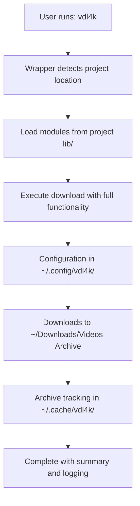
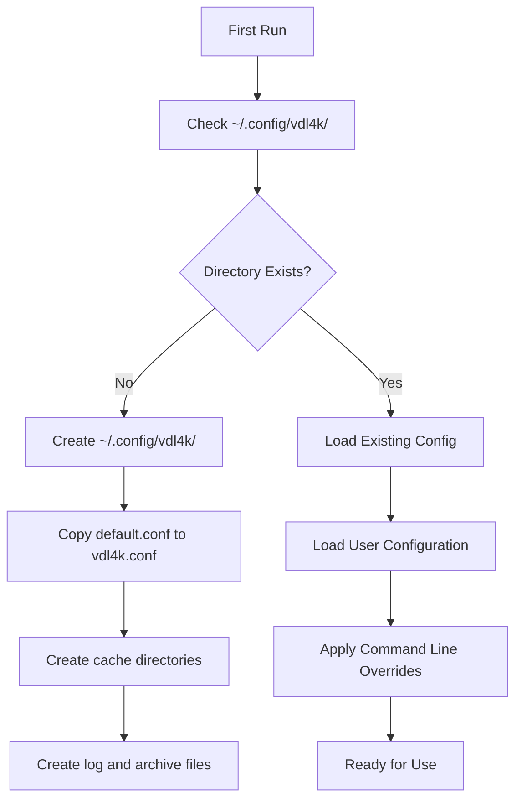

# vdl4k Modular Architecture Flowchart


## Module Interaction Flow

```mermaid
graph LR
    A[bin/vdl4k] --> B[lib/config.sh]
    A --> C[lib/utils.sh]
    A --> D[lib/validators.sh]
    A --> E[lib/video_utils.sh]
    A --> F[lib/archive.sh]
    A --> G[lib/download.sh]

    B --> H[Configuration Files]
    H --> I[default.conf]
    H --> J[user config]
    H --> K[override config]

    C --> L[Logging & Output]
    C --> M[Directory Management]
    C --> N[Temp Directory Setup]

    D --> O[URL Validation]
    D --> P[Video ID Extraction]
    D --> Q[Metadata Retrieval]

    E --> R[Resolution Detection]
    E --> S[Quality Comparison]
    E --> T[File Analysis]

    F --> U[Archive Management]
    F --> V[Download History]
    F --> W[Statistics]

    G --> X[yt-dlp Integration]
    G --> Y[File Processing]
## Key Improvements in v0.57

1. **XDG Base Directory Compliance**: Uses `~/.local/bin` following Linux standards
2. **Enhanced PATH Management**: Improved shell integration with duplicate prevention
3. **Robust Project Detection**: Multiple fallback methods for finding project modules
4. **Cross-Shell Compatibility**: Seamless support for both bash and zsh environments
5. **Standard Installation Paths**: Follows XDG Base Directory specification
6. **Professional Installation Experience**: One-command setup with comprehensive error handling

## Installation Flow

{{ ... }}
graph TD
    A[User Downloads vdl4k] --> B[Clone Repository]
    B --> C[Run ./install.sh]
    C --> D[Check Dependencies: yt-dlp, ffmpeg, ffprobe]
    D --> E{Create ~/.local/bin Directory?}
    E -->|No| F[Skip]
    E -->|Yes| G[Create ~/.local/bin Directory]
    G --> H[Update PATH in .bashrc/.zshrc]
    H --> I[Install Global Wrapper Script]
    I --> J[Install Portable Version to ~/.local/bin/]
    J --> K[Verify Installation]
    K --> L[Installation Complete]

    style I fill:#bbf,stroke:#333,stroke-width:2px
```

## Post-Installation Usage



## Configuration Flow



## Documentation

The vdl4k project includes comprehensive documentation:

- **[README.md](README.md)**: Main project documentation, installation guide, and usage examples
- **[DEVELOPMENT.md](DEVELOPMENT.md)**: Development workflow, branch naming conventions, and contribution guidelines
- **[FLOWCHART.md](FLOWCHART.md)**: Architecture diagrams and system flow visualization
- **[GOALS](GOALS)**: Project objectives and design principles
